# TensorFlow 2.0 with Azure MLOps

## Overview

For this exercise, we assume that you have trained and deployed a machine learning model and that you are now ready to manage the end-to-end lifecycle of your model. [MLOps](https://docs.microsoft.com/azure/machine-learning/service/concept-model-management-and-deployment) can help you to automatically deploy your model as a web application while implementing quality benchmarks, strict version control, model monitoring, and providing an audit trail.

## Prerequisites

You must have access to a project in ADO (Azure DevOps). And also you must make sure a Service Principal is create and assigend to the resource group as contributor. If you don't have project repo or service principal, please create [SP](./3.1.CreateSP.md) and [ADO Project](./3.2.CreateProjectinADO.md).

    [  ] Project in Azure DevOps
    [  ] Service Principal 

While they are not required to complete this exercise, the notebooks on [training](aka.ms/tfworld_training) and [inferencing](aka.ms/tfworld_inferencing) that are included in this repo provide useful context for this exercise. 

    [  ] Compute Cluster

## 1. Create an Azure DevOps variable group

We make use of variable group inside Azure DevOps to store variables that we want to make available across multiple pipelines. To create a variable group, open Azure DevOps, then click "Pipelines"->"Library" on the left-hand side.

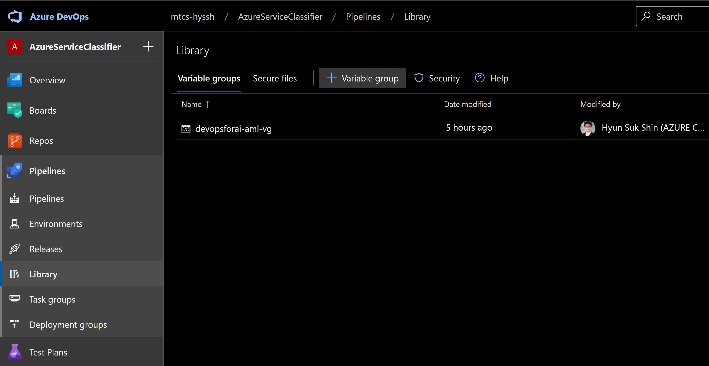

 In the menu near the top of the screen, click "+ Variable group." Name your variable group **``devopsforai-aml-vg``** as this value is hard-coded within our [build yaml file](../yml/publish-training-pipeline.yml).

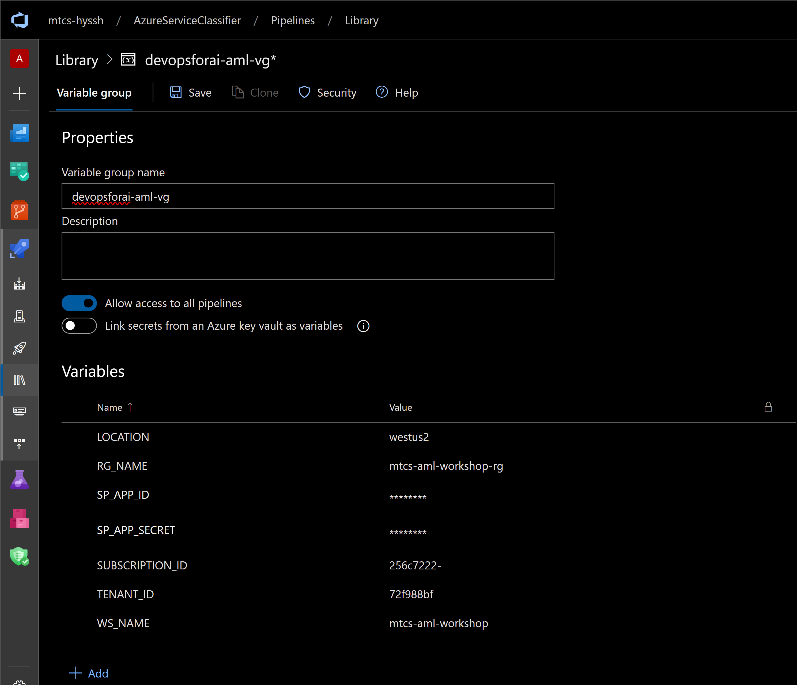

The variable group should contain the following variables:

| Variable Name               | Value              |
| --------------------------- | ---------------------------- |
| `LOCATION`                    | _AML SERVICE REGION_ i.e. 'westus2'                  |
| `RG_NAME`                    | _NAME OF RESOURCE GROUP_                  |
| `SP_APP_ID`                    | Fill in "Application (client) ID" from service principal creation                  |
| `SP_APP_SECRET`                    | Fill in the secret from service principal creation SECRET _Mark **SP_APP_SECRET** variable as a secret one._                  |
| `SUBSCRIPTION_ID`                    | Fill in your Azure subscription ID, found on the "Overview" page of your subscription in the Azure portal                |
| `TENANT_ID`                    | Fill in the value of "Directory (tenant) ID" from service principal creation                   |
| `WS_NAME`                   | Fill in Azure Machine Learning Workspace Name |

Make sure to select the **Allow access to all pipelines** checkbox in the variable group configuration.

## 2. Set up a build pipeline

Let's review what we have so far. We have created a Machine learning workspace in Azure and some other things that go with it (a datastore, a keyvault, and a container registry). Ultimately, we want to have a deployed model that we can run queries against. So now that we have this workspace, let's use it to create a model!

### 2.1 Pipeline overview

First, [open](./yml/publish-training-pipeline.yml) up the build .yml file in GitHub. 

The YAML file includes the following steps:

1. It [configures triggers](https://docs.microsoft.com/azure/devops/pipelines/yaml-schema?view=azure-devops&tabs=schema#pr-trigger) that specify which events (such as GitHub pull requests) should cause the model to be rebuilt. 
1. It specifies a the type of VM image from which to create a [pool](https://docs.microsoft.com/azure/devops/pipelines/yaml-schema?view=azure-devops&tabs=schema#pool) for running the training pipeline.
1. It specified [steps](https://docs.microsoft.com/azure/devops/pipelines/yaml-schema?view=azure-devops&tabs=schema#steps) to run, by importing the contents of a different YAML file.
1. It specified some [tasks](https://docs.microsoft.com/azure/devops/pipelines/yaml-schema?view=azure-devops&tabs=schema#task), including [invoking bash](https://docs.microsoft.com/azure/devops/pipelines/yaml-schema?view=azure-devops&tabs=schema#bash) to run a Python script, [copying files](https://docs.microsoft.com/azure/devops/pipelines/tasks/utility/copy-files?view=azure-devops&tabs=yaml), and [publishing a build artifact](https://docs.microsoft.com/azure/devops/pipelines/tasks/utility/publish-build-artifacts?view=azure-devops).

### 2.2 Running your pipeline

Now that you understand the steps in your pipeline, let's see what it actually does!

In your [Azure DevOps](https://dev.azure.com) project, use the left-hand menu to navigate to "Pipelines"->"Build" and then select "New pipeline". 

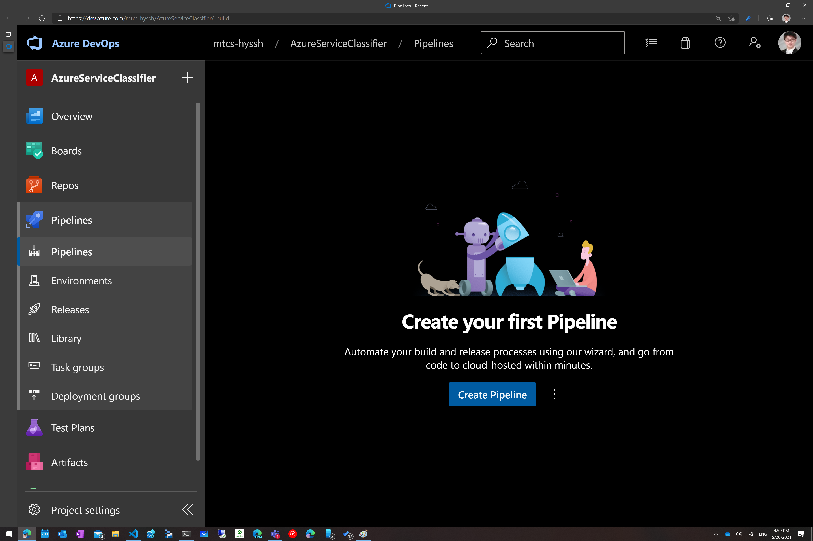

Next select "Azure Repos Git."

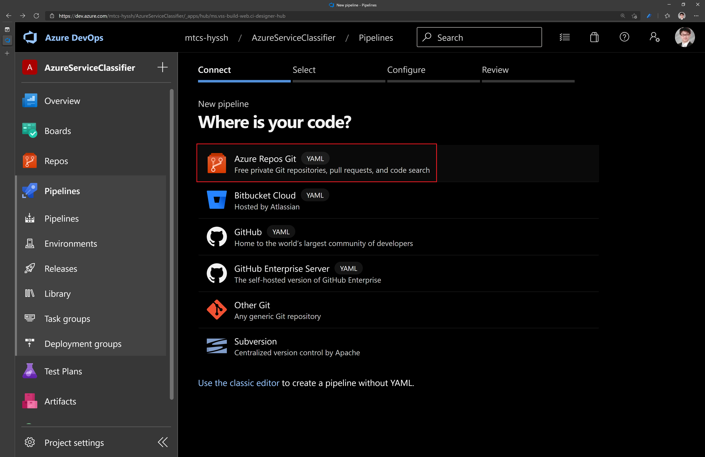

Select the correct branch of your GitHub repo and select the path referring to [publish-training-pipeline.yml](./yml/publish-training-pipeline.yml) in your forked **GitHub** repository.

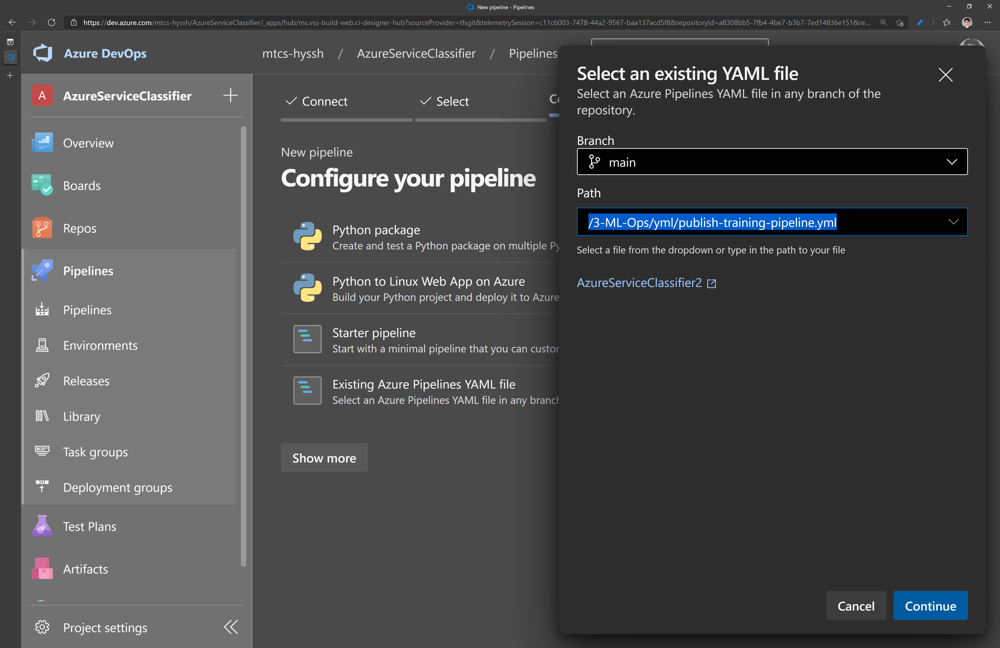

You will now be redirected to a review page. Check to make sure you still understand what this pipeline is doing. If everything looks good, click "Run."

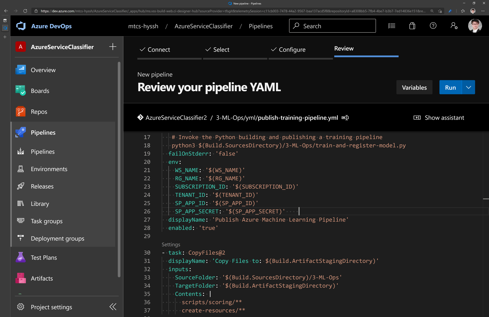

Great, you now have the build pipeline setup, you can either manually trigger it whenever you like or let it be automatically triggered every time there is a change in the master branch.

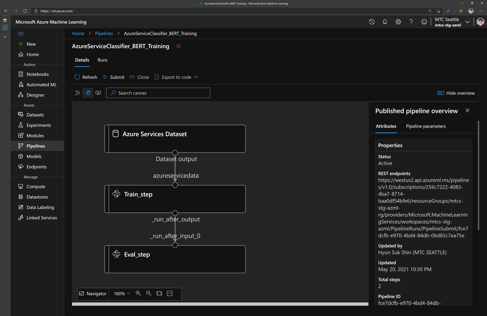

## 3. Create the release pipeline.

The final step is to deploy your model with a release pipeline.

Go to "Pipelines" -> "Releases." 

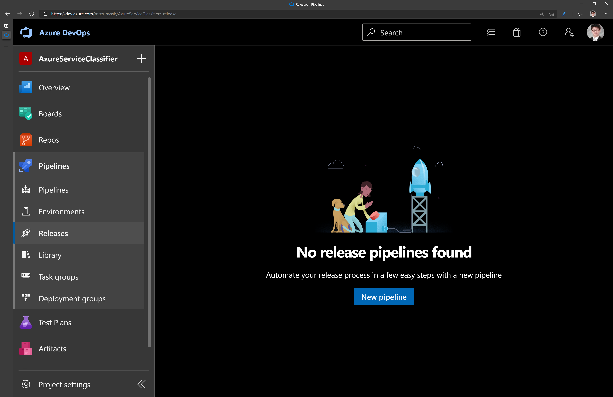

In the top right of the second navigation bar from the left, select "New" -> "New release pipeline." Select "Empty job" under "Select a template" on the blade that pops up. 

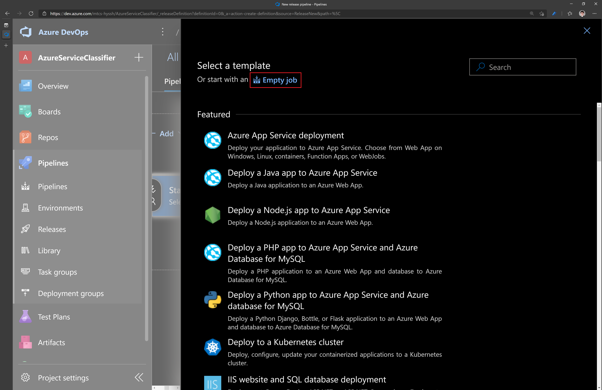

Call this stage "Prod," by editing the value of "Stage name" in the blade on the right hand side. 

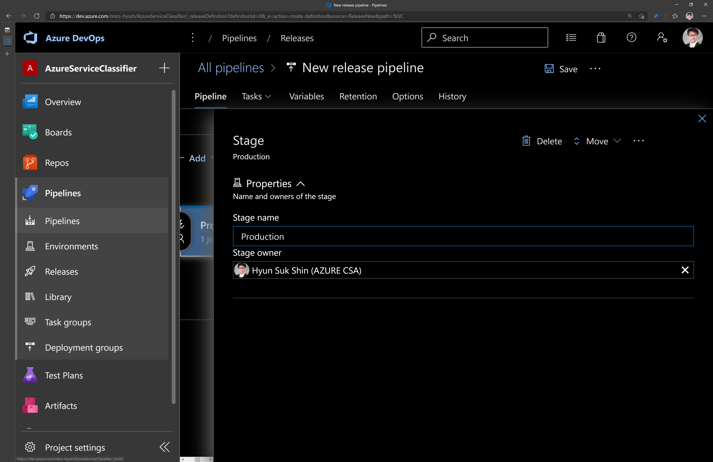

### 3.1. Add artifacts to your pipeline

In order for this Release pipeline to work, it needs access to the trained model we produced in the build pipeline. The release pipeline accesses the trained model as part of something called an Artifact. To give this release pipeline access to the relevant artifacts, click on "Add an artifact" in the "Artifacts" box.

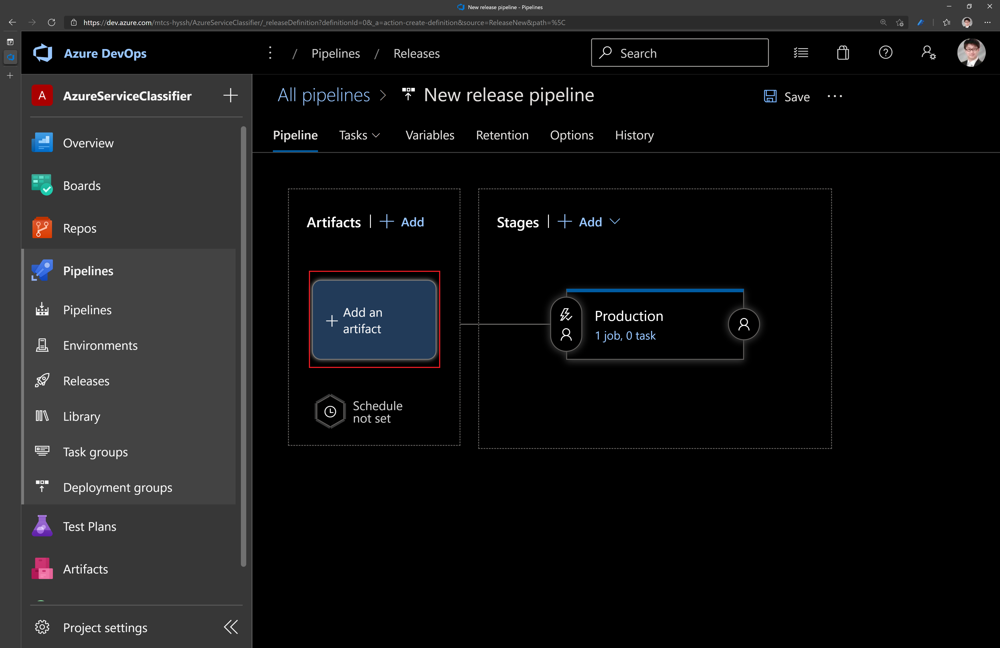

Next, select "AzureML Model Artifact" (you may need to click "Show more"). 

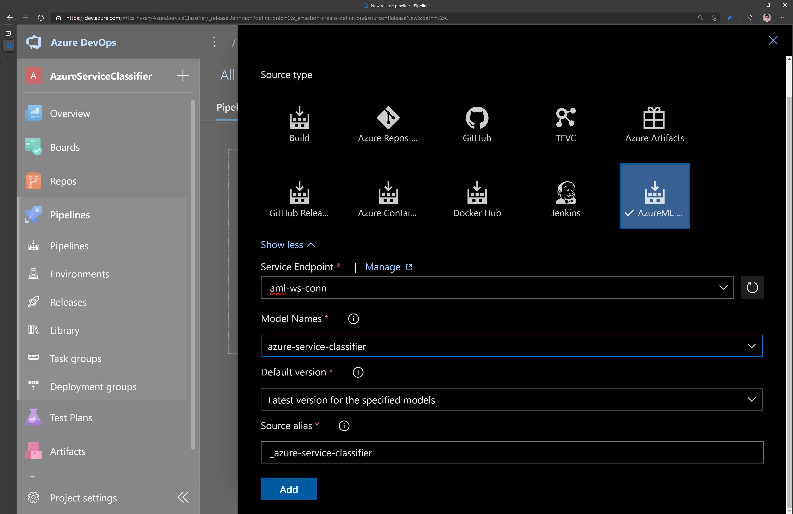

Select the correct service endpoint (you should have created this in the previous step) and model name. Leave the other settings as they are, and click "Add."

Let's also give the release pipeline access to the build artifact, which contains some of the files that the release pipeline needs in order to run. Click on "Add" in the "Artifacts" box, select "Build," and ensure that the source alias is set to "_ci-build". This naming is necessary for the next step to work properly.


### 3.2. Add QA stage

Great, so your release pipeline has access to your artifacts, but it doesn't actually _do_ anything. Let's give it some work. First, let's have it deploy to a quality assurance (QA) instance hosted with Azure Container Instances (ACI).

Click on the hyperlinked text that says "1 job, 0 task" in the name of the stage.

Click on the plus icon on the right hand side of the cell which says "Agent job." On the menu which appears, search for "Azure ML Model Deploy," and click "Add."

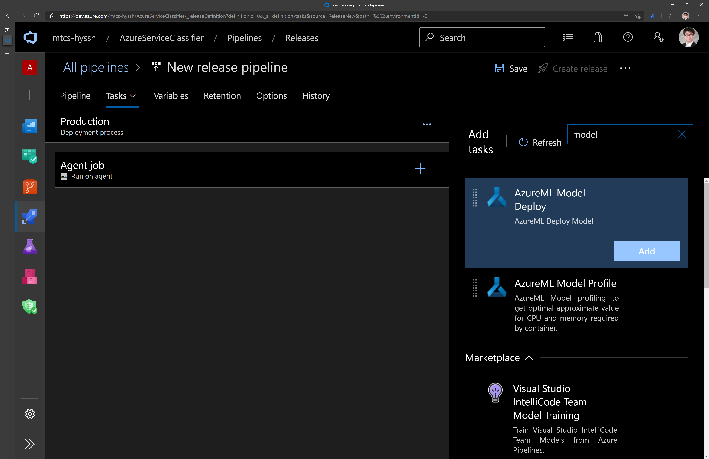

 Click on the red text which says "Some settings need attention" and fill in the values shown in the table below:

| Parameter                         | Value                                                                                                |
| --------------------------------- | ---------------------------------------------------------------------------------------------------- |
| Display Name                      | Azure ML Model Deploy                                                                                |
| Azure ML Workspace                | Fill in the name of your Azure ML service connection                                                               |
| Inference config Path             | `$(System.DefaultWorkingDirectory)/_azure-service-classifier/3-ML-Ops/scripts/scoring/inference_config.yml`      |
| Model Deployment Target           | Azure Container Instance                                                                             |
| Deployment Name                   | bert-stack-overflow-aci                                                                              |
| Deployment Configuration file     | `$(System.DefaultWorkingDirectory)/_azure-service-classifier/3-ML-Ops/scripts/scoring/deployment_config_aci.yml` |
| Overwrite existing deployment     | X                                                                                                    |

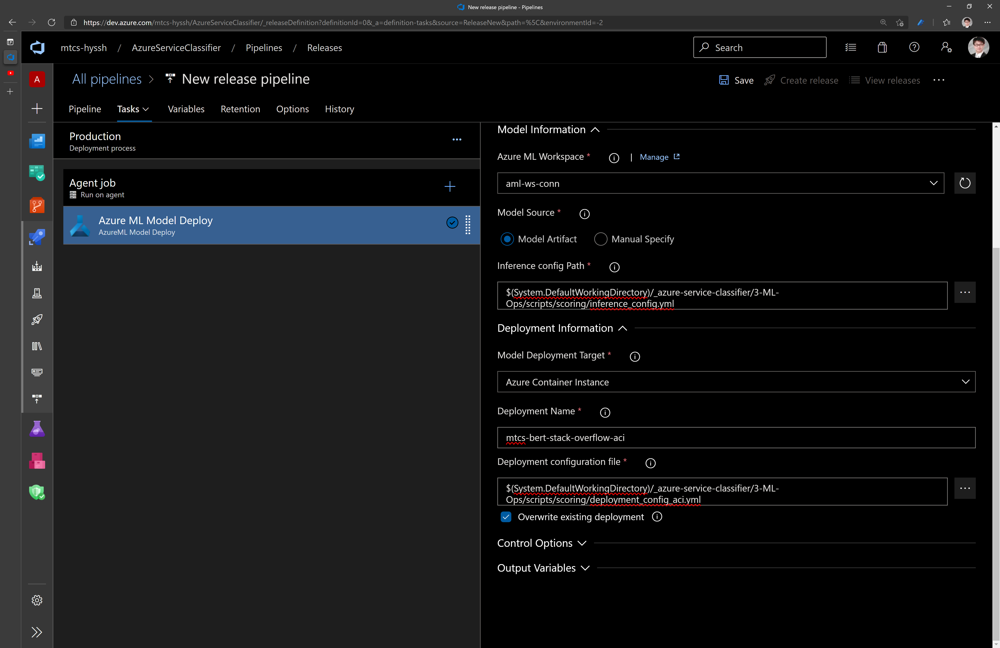

Then click "Save."

### 3.3. Add Prod Stage

Under the box corresponding to the QA stage, click Prod.

Click on the plus icon on the right hand side of the cell which says "Agent job." On the menu which appears, search for "Azure ML Model Deploy," and click "Add."


 Click on the red text which says "Some settings need attention" and fill in the values shown in the table below:


 Click on the red text which says "Some settings need attention" and fill in the values shown in the table below:

| Parameter                         | Value                                                                                                |
| --------------------------------- | ---------------------------------------------------------------------------------------------------- |
| Display Name                      | Azure ML Model Deploy                                                                                |
| Azure ML Workspace                | Fill in the name of your Azure ML service connection                                                               |
| Inference config Path             | `$(System.DefaultWorkingDirectory)/_ci-build/mlops-pipelines/scripts/scoring/inference_config.yml`      |
| Model Deployment Target           | Azure Kubernetes Service                                                                             |
| Select AKS Cluster for Deployment | myaks (**This value is specified in the .env file, and you should have an existing cluster with this name**)        |
| Deployment Name                   | bert-stack-overflow-aks                                                                               |
| Deployment Configuration file     | `$(System.DefaultWorkingDirectory)/_ci-build/mlops-pipelines/scripts/scoring/deployment_config_aks.yml` |
| Overwrite existing deployment     | X                                                                                                    |

Then click "Save."

After you enable continuous integration (next step), your pipeline should look like this:


### 3.4. Enable continuous integration

Go to "Pipelines" -> "Releases," click on your new pipeline, then click "Edit." In the top right of each artifact you specified, you should see a lightning bolt. Click on this lightning bolt and then toggle the trigger for "Continuous deployment." This will ensure that the deployment is released every time one of these artifacts changes. Make sure to save your changes.

To kick off your first deployment, click "Create release."


### 3.5. Test your deployed model

Open your machine learning workspace in the [Azure portal](portal.azure.com), and click on "Deployments" on the lefthand side. Open up your AKS cluster, and use the Scoring URI and Primary Key for this step.


Let's see if we can submit a query to our deployed model! Open up a Python interpreter, either on your local machine or on an Azure Notebook, and run the following code, making sure to substitute the URL of your webservice and your API key as appropriate:

```python
import json
import requests

url = '<your scoring url here>'
api_key = '<your API key here>'

def predict_tags(question_body):
    payload = {'text': question_body}
    headers = {'content-type': 'application/json', 'Authorization':('Bearer '+ api_key)}
    response = requests.post(url, data=json.dumps(payload), headers=headers)
    response_body = json.loads(response.content)  # convert to dict for next step
    print("Given your question of \"{}\", we predict the tag is {} with probability {}"
          .format(payload.get("text"), response_body.get("prediction"), response_body.get("probability")))

predict_tags('How can I specify Service Principal in devops pipeline when deploying virtual machine?')
```


Congratulations! You have two pipelines set up end to end:
   - Build pipeline: triggered on code change to master branch on GitHub, performs linting, unit testing and publishing a training pipeline. Also train, evaluate and register a model
   <!-- - Release Trigger pipeline: runs a published training pipeline to  -->
   - Release Deployment pipeline: triggered when build artifacts change or registered model changes, deploys a model to a Prod (AKS) environment
