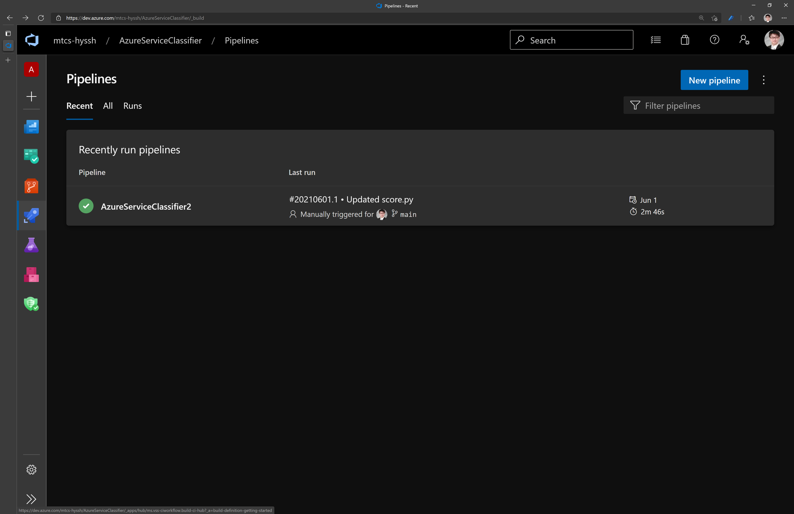
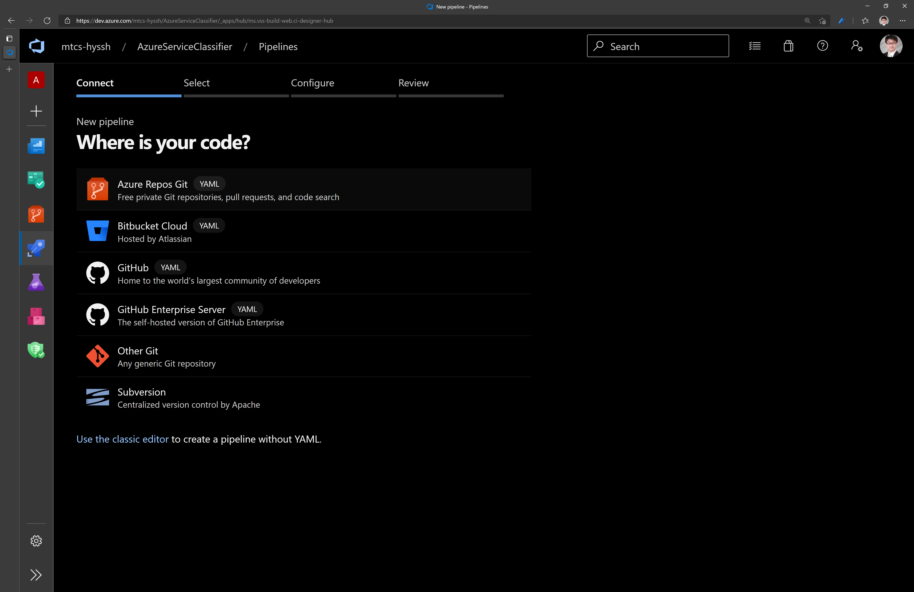
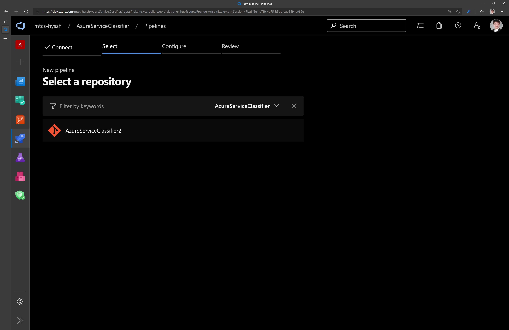
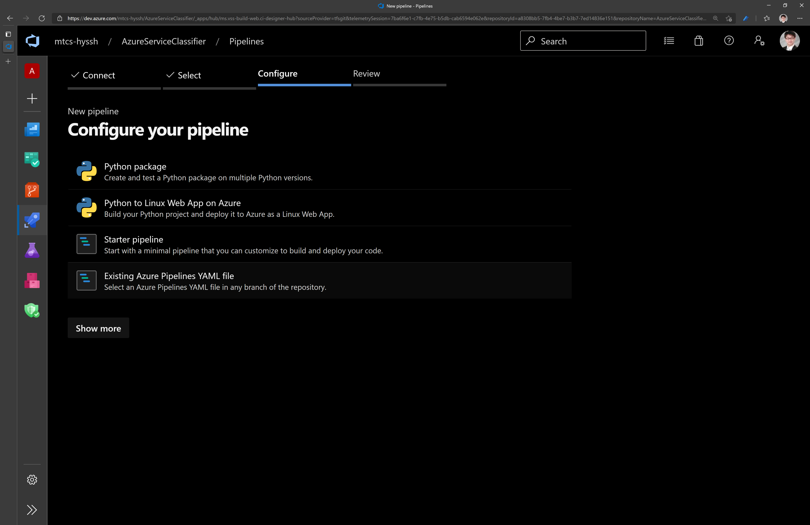
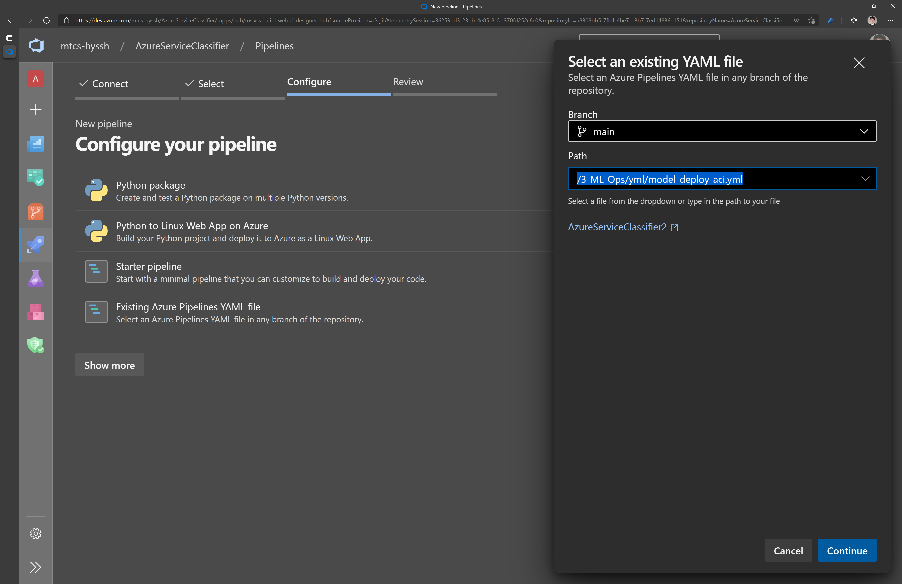
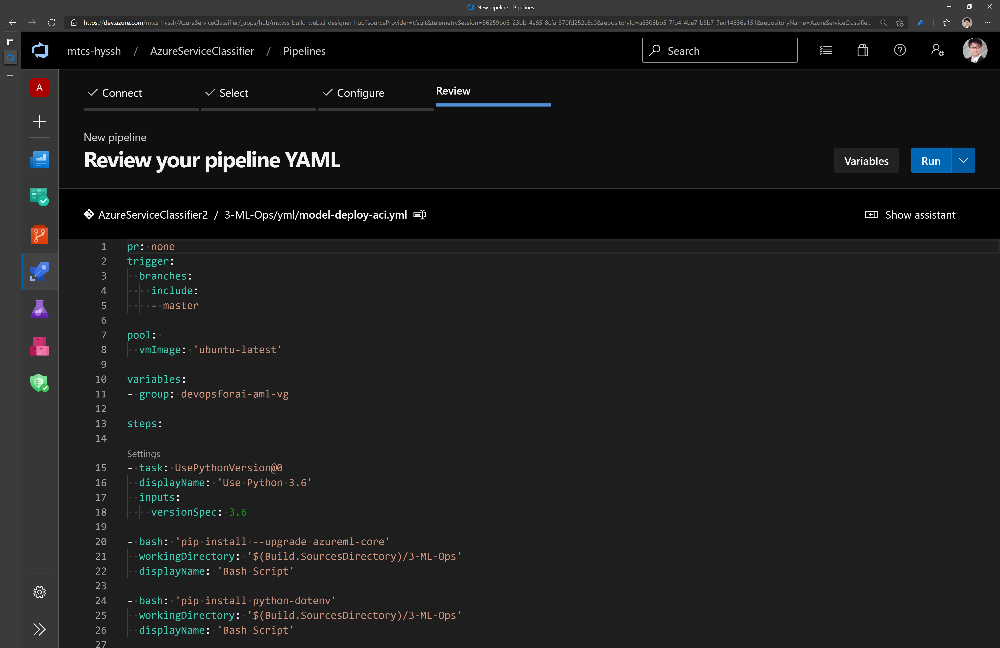
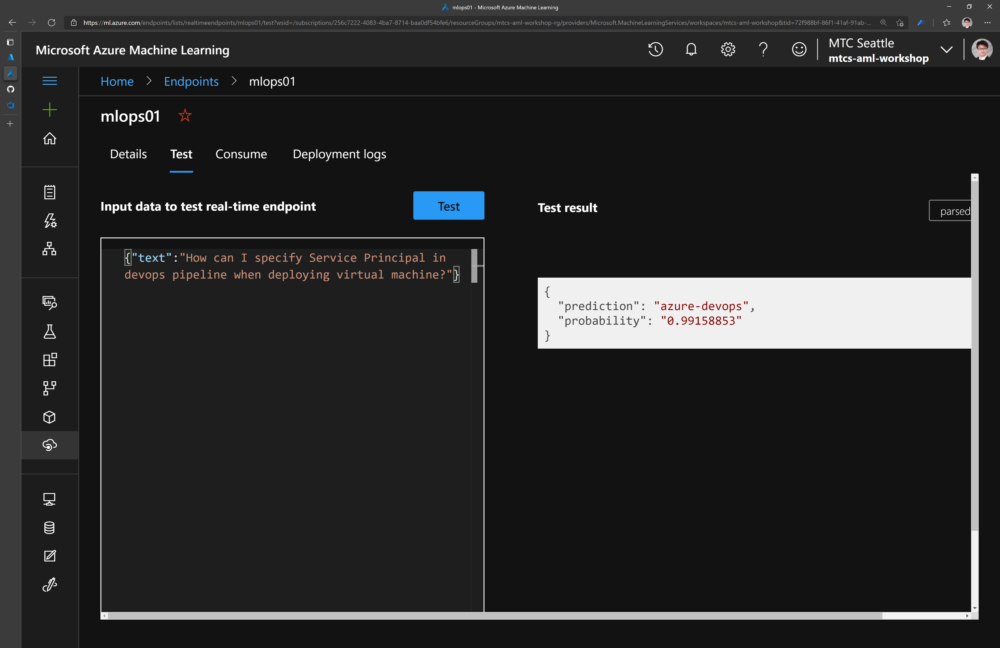

# TensorFlow 2.0 with Azure MLOps

## Overview

For this exercise, we assume that you have trained and deployed a machine learning model and that you are now ready to manage the end-to-end lifecycle of your model. [MLOps](https://docs.microsoft.com/azure/machine-learning/service/concept-model-management-and-deployment) can help you to automatically deploy your model as a web application while implementing quality benchmarks, strict version control, model monitoring, and providing an audit trail.

## Prerequisites

You must have access to a project in ADO (Azure DevOps). And also you must make sure a Service Principal is create and assigend to the resource group as contributor. If you don't have project repo or service principal, please create [SP](./3.1.CreateSP.md) and [ADO Project](./3.2.CreateProjectinADO.md).

    [  ] Project in Azure DevOps
    [  ] Service Principal 

While they are not required to complete this exercise, the notebooks on [training](aka.ms/tfworld_training) and [inferencing](aka.ms/tfworld_inferencing) that are included in this repo provide useful context for this exercise. 

    [  ] Compute Cluster

## 1. Create an Azure DevOps variable group

We make use of variable group inside Azure DevOps to store variables that we want to make available across multiple pipelines. To create a variable group, open Azure DevOps, then click "Pipelines"->"Library" on the left-hand side.


 In the menu near the top of the screen, click "+ Variable group." Name your variable group **``devopsforai-aml-vg``** as this value is hard-coded within our [build yaml file](../yml/publish-training-pipeline.yml).


The variable group should contain the following variables:

| Variable Name               | Value              |
| --------------------------- | ---------------------------- |
| `LOCATION`                    | _AML SERVICE REGION_ i.e. 'westus2'                  |
| `RG_NAME`                    | _NAME OF RESOURCE GROUP_                  |
| `SP_APP_ID`                    | Fill in "Application (client) ID" from service principal creation                  |
| `SP_APP_SECRET`                    | Fill in the secret from service principal creation SECRET _Mark **SP_APP_SECRET** variable as a secret one._                  |
| `SUBSCRIPTION_ID`                    | Fill in your Azure subscription ID, found on the "Overview" page of your subscription in the Azure portal                |
| `TENANT_ID`                    | Fill in the value of "Directory (tenant) ID" from service principal creation                   |
| `WS_NAME`                   | Fill in Azure Machine Learning Workspace Name |

Make sure to select the **Allow access to all pipelines** checkbox in the variable group configuration.

## 2. Set up a build pipeline

Let's review what we have so far. We have created a Machine learning workspace in Azure and some other things that go with it (a datastore, a keyvault, and a container registry). Ultimately, we want to have a deployed model that we can run queries against. So now that we have this workspace, let's use it to create a model!

### 2.1 Pipeline overview

First, [open](./yml/publish-training-pipeline.yml) up the build .yml file in GitHub. 

The YAML file includes the following steps:

1. It [configures triggers](https://docs.microsoft.com/azure/devops/pipelines/yaml-schema?view=azure-devops&tabs=schema#pr-trigger) that specify which events (such as GitHub pull requests) should cause the model to be rebuilt. 
1. It specifies a the type of VM image from which to create a [pool](https://docs.microsoft.com/azure/devops/pipelines/yaml-schema?view=azure-devops&tabs=schema#pool) for running the training pipeline.
1. It specified [steps](https://docs.microsoft.com/azure/devops/pipelines/yaml-schema?view=azure-devops&tabs=schema#steps) to run, by importing the contents of a different YAML file.
1. It specified some [tasks](https://docs.microsoft.com/azure/devops/pipelines/yaml-schema?view=azure-devops&tabs=schema#task), including [invoking bash](https://docs.microsoft.com/azure/devops/pipelines/yaml-schema?view=azure-devops&tabs=schema#bash) to run a Python script, [copying files](https://docs.microsoft.com/azure/devops/pipelines/tasks/utility/copy-files?view=azure-devops&tabs=yaml), and [publishing a build artifact](https://docs.microsoft.com/azure/devops/pipelines/tasks/utility/publish-build-artifacts?view=azure-devops).

### 2.2 Running your pipeline

Now that you understand the steps in your pipeline, let's see what it actually does!

In your [Azure DevOps](https://dev.azure.com) project, use the left-hand menu to navigate to "Pipelines"->"Build" and then select "New pipeline". 


Next select "Azure Repos Git."


Select the correct branch of your GitHub repo and select the path referring to [publish-training-pipeline.yml](./yml/publish-training-pipeline.yml) in your forked **GitHub** repository.


You will now be redirected to a review page. Check to make sure you still understand what this pipeline is doing. If everything looks good, click "Run."


Great, you now have the build pipeline setup, you can either manually trigger it whenever you like or let it be automatically triggered every time there is a change in the master branch.


## 3. Create the release pipeline.

The final step is to deploy your model with a release pipeline.

Go to "Pipelines" -> "Pipelines.",



Next select 'Azure Repos Git',



And, click 'AzureServiceClassifier',



Click 'Existing Azure Pipelines YAML file



And then, select '/3-ML-Ops/yml/model-deploy-aci.yml'



Review and then click 'Run' to execute the pipeline




### 4. Test your deployed model

Open Azure Machine Learning Studio, and find the model deployed in 'End point'. Select 'Test' tab to make prediction for test. 

Use following sample for the test.

```json
{ "text": "How can i specify service principal in devops pipeline when deploying virtual machine?"}
```




Congratulations! You have two pipelines set up end to end:
   - Build pipeline: triggered on code change to master branch on GitHub, performs linting, unit testing and publishing a training pipeline. Also train, evaluate and register a model
   <!-- - Release Trigger pipeline: runs a published training pipeline to  -->
   - Release Deployment pipeline: triggered when build artifacts change or registered model changes, deploys a model to a Prod (AKS) environment
