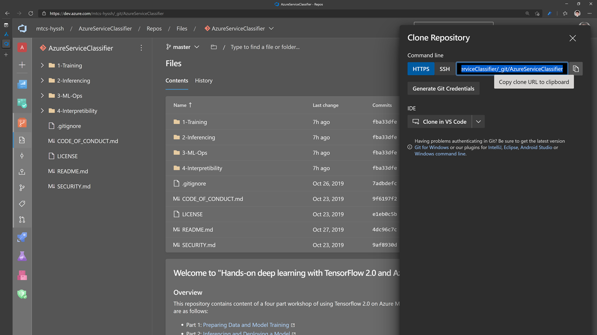
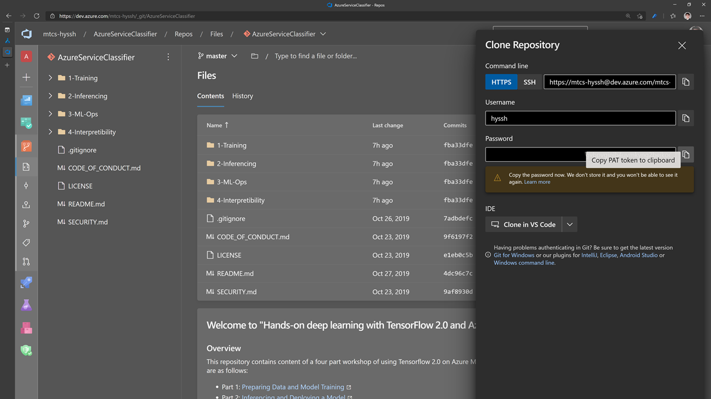
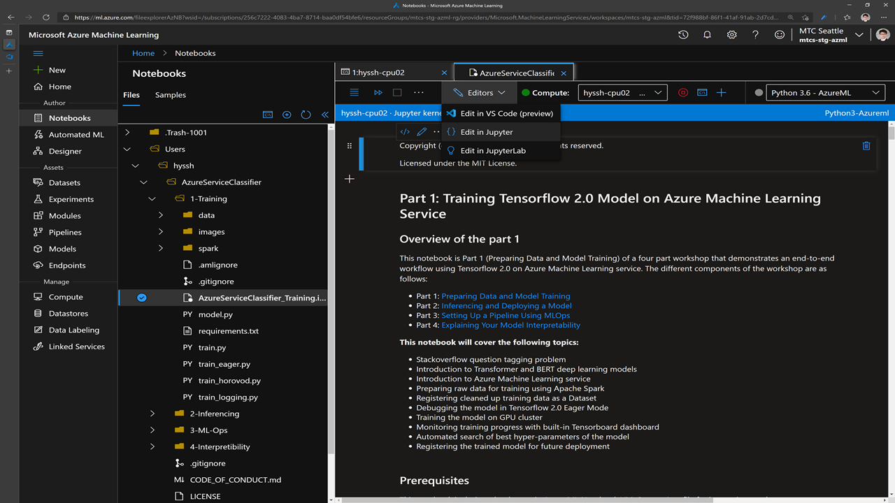

# Welcome to "NLP on Azure – Hands-on Labs for MLOps"

<!-- 
Guidelines on README format: https://review.docs.microsoft.com/help/onboard/admin/samples/concepts/readme-template?branch=master

Guidance on onboarding samples to docs.microsoft.com/samples: https://review.docs.microsoft.com/help/onboard/admin/samples/process/onboarding?branch=master

Taxonomies for products and languages: https://review.docs.microsoft.com/new-hope/information-architecture/metadata/taxonomies?branch=master
-->

## Overview

This repository contains content of a four part workshop of using Tensorflow 2.0 on Azure Machine Learning service. The different components of the workshop are as follows:

- Part 1: [Preparing Data and Model Training](https://github.com/xlegend1024/bert-stack-overflow/blob/master/1-Training/AzureServiceClassifier_Training.ipynb)
- Part 2: [Inferencing and Deploying a Model](https://github.com/xlegend1024/bert-stack-overflow/blob/master/2-Inferencing/AzureServiceClassifier_Inferencing.ipynb)
- Part 3: [Setting Up a Pipeline Using MLOps](https://github.com/xlegend1024/bert-stack-overflow/blob/master/3-ML-Ops/AzureServiceClassifier_AML_Pipeline.ipynb)
- Part 4: [Explaining Your Model Predictions](https://github.com/xlegend1024/bert-stack-overflow/blob/master/4-Interpretibility/EmployeeAttritionClassifier_Interpretability_Local.ipynb)

The workshop demonstrates end-to-end Machine Learning workflow on the example of training a [BERT](https://arxiv.org/pdf/1810.04805.pdf) model to automatically tag questions on Stack Overflow.

## Getting started with the workshop environment

1. Login to Azure ML studio

    * Once the workshop enviroment is ready, you can open new browser tab and navigate to Azure ML studio, using it's direct URL: [https://ml.azure.com](https://ml.azure.com). We recommend to use Private Browser window for the login to avoid conflicting credentials if you already have Azure subscription.
    * Use credentials provided in the workshop environment to sign-in to Azure ML studio.
    * In the Welcome screen select preprovisioned subcription and workspace similar to screenshot below:
    
    * Click **Get started**!
    * In the welcome screen click on **Take a quick tour** button to familiarize yourself with Azure ML studio.

1. Create Azure Machine Learning Compute Instance VM

    * Click on **Compute** tab on the left navigation bar.
    * In the Compute Instance section, click **New**.
    * Enter Compute Instance name of your choice and click **Create**. Creation should take approximately 5 minutes.
    
    

1. Clone this repository to Compute Instance in your Azure ML workspace

    * Once Compute Instance is created and in Running state, click on the **Jupyter** link. This will open Jupyter web UI in new browser tab.
    * In Jupyter UI click **New > Terminal**
    * Notice the name of your user folder and run following command
    * Clone the repository of this workshop by executing following command: 
    
    ```bash
    git clone [yourRepoURI]
    ```

    

    * If you need password to clone repo, go to repo in ADO; click 'Genterate Git Creadentials'; copy the password;

    

1. Open Part 1 of the workshop

    * Go back to the Jupyter window.
    * Navigate to `bert-stack-overflow/1-Training/` folder.
    * Open `AzureServiceClassifier_Training.ipynb` notebook.

    

You are ready to start your workshop! Have fun.
